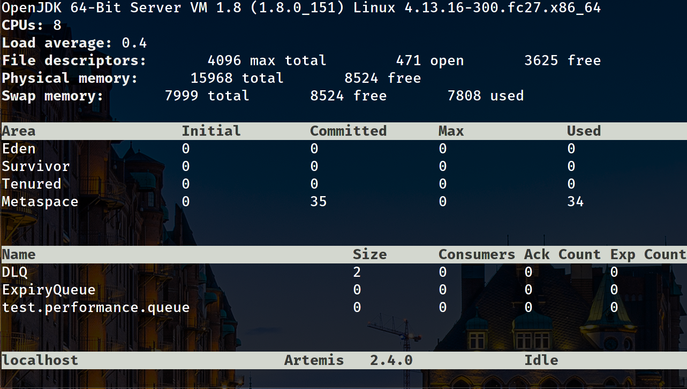

BMIC: Broker Management Interface Client
============

Build Status
----
Linux Build Status: [](https://travis-ci.org/orpiske/bmic)

Coverity Scan: [](https://scan.coverity.com/projects/orpiske-bmic)

Packaging Status
----
Fedora (Testing Repo): [](https://copr.fedorainfracloud.org/coprs/orpiske/orp-tools-testing/package/bmic/)

Fedora (Testing Repo - Legacy): [](https://copr.fedorainfracloud.org/coprs/orpiske/orp-tools-testing-legacy/package/bmic/)

Fedora (Stable Repo): [](https://copr.fedorainfracloud.org/coprs/orpiske/orp-tools-stable/package/bmic/)


Introduction:
----

This project contains a library and a command-line client that allows you to
access the management interface for messaging brokers such as Apache ActiveMQ,
Apache Artemis, JBoss A-MQ 6 and JBoss A-MQ 7.

This is a work in progress.

**How does it look like?**

Here's a sample screenshot of one of its feature, a top-like view of ActiveMQ Artemis 2.4 broker.




Installation:
----

The code can be installed via Fedora COPR. Packages are available for CentOS 6, 7, Fedora 25 
or greater and RHEL 6 and 7. For CentOS 6 and RHEL 6, please use the legacy repos (check the notes below).

**Testing**

1. Enable my testing COPR.

```dnf copr enable orpiske/orp-tools-testing```

2. Install the runtime only:
```dnf install -y bmic```

3. (Alternative) Install the development packages: 
```dnf install -y bmic bmic-devel bmic-devel-doc```

**Note**: the testing packages are the **recommended** packages for this project.

**Note**: for RHEL 6 or CentOS 6, use the orp-tools-testing-legacy repository.

**Stable**

1. Enable my testing COPR.

```dnf copr enable orpiske/orpiske/orp-tools-stable ```

2. Install the runtime only:
```dnf install -y bmic```

3. (Alternative) Install the development packages: 
```dnf install -y bmic bmic-devel bmic-devel-doc```

Note: at the moment, they are outdated and do not support latest versions of Apache Artemis.

Dependencies:
----

Runtime/Compilation:
* cmake
* gcc or clang
* [gru](https://github.com/orpiske/gru)
* [json-c](https://github.com/json-c/json-c)


Limitations:
----

Does not fully support clusters. Commands may need to be send to each individual node on the 
cluster.

It is also necessary to pay attention providing correct permissions to the users accessing the console. Due to the 
ever-changing management APIs, support for newer versions of the brokers is likely to be broken or limited for some 
time. 


Usage Example:
----

Discovery:

```
bmic discovery -u admin -p admin -s localhost
The product name is artemis
The API version is artemis
The product version is: 2.0.0.amq-70000
```

Listing queues:

```
bmic queue -l -u admin -p admin -s localhost
Queue name: jms.queue.jms.queue.cli2.test.notcore
Queue name: jms.queue.DLQ
Queue name: jms.queue.ExpiryQueue
Queue name: test.performance.queue
Queue name: jms.queue.cli1.test.notcore
Queue name: jms.queue.cli2.test.notcore
```

Creating queues:
```
./bmic queue -c -n new.queue -u admin -p admin -s localhost
```

Deleting queues:
```
./bmic queue -d -n new.queue -u admin -p admin -s localhost
```

Purging queues:
```
./bmic queue -n new.queue -u admin -p admin -s localhost --purge
```


Displaying Core Capabilities:
```
bmic capabilities --read-all -u admin -p admin -s localhost                          
Capability Value                    
                  ManagementAddress activemq.management      
                  ConnectorServices (null)
                    JournalMinFiles 2
                          Clustered true
           FailoverOnServerShutdown false
             JournalCompactMinFiles 10
 PersistDeliveryCountBeforeDelivery false
        MessageExpiryThreadPriority 3
              ConnectionTTLOverride -1
                 PersistenceEnabled true
           JournalCompactPercentage 30
                  CreateBindingsDir true
                    ConnectionCount 7
                            Version 2.0.0.amq-700008-redhat-1
                   JournalDirectory ./data/journal           
                       UptimeMillis 2090485954
      ManagementNotificationAddress activemq.notifications   
                        DivertNames (null)
        JournalSyncNonTransactional true
               TotalConnectionCount 13
                        SharedStore false
                         QueueNames 
                                    cli.test
                                    ExpiryQueue
                                    test.verification.queue
                                    notif.d37f2b1c-5274-11e7-8712-fa163ee72f6a.ActiveMQServerImpl_serverUUID=15ff3f1e-5029-11e7-bf57-fa163ee72f6a
                                    $.artemis.internal.sf.my-cluster.15ff3f1e-5029-11e7-bf57-fa163ee72f6a
                                    DLQ
                                    somequeue
                                    $.artemis.internal.sf.my-cluster.17d1dc37-5029-11e7-86e7-fa163ebba8ef
                                    test.performance.queue
                                    notif.d62481f3-5274-11e7-8954-fa163ebba8ef.ActiveMQServerImpl_serverUUID=17d1dc37-5029-11e7-86e7-fa163ebba8ef
                    PagingDirectory ./data/paging            
             LargeMessagesDirectory ./data/large-messages    
                  JournalBufferSize 501760
       SecurityInvalidationInterval 10000
         MessageCounterSamplePeriod 10000
                 TotalMessagesAdded 143
                 TotalConsumerCount 2
                        BridgeNames (null)
             WildcardRoutingEnabled true
                     PersistIDCache true
    AsyncConnectionExecutionEnabled true
                            Started true
                  TotalMessageCount 135
                   CreateJournalDir true
                      GlobalMaxSize 104857600
                             Backup false
                       AddressNames 
                                    somequeue
                                    $.artemis.internal.sf.my-cluster.17d1dc37-5029-11e7-86e7-fa163ebba8ef
                                    test.verification.queue
                                    DLQ
                                    ExpiryQueue
                                    cli.test
                                    activemq.notifications
                                    test.performance.queue
                                    $.artemis.internal.sf.my-cluster.15ff3f1e-5029-11e7-bf57-fa163ee72f6a
          TotalMessagesAcknowledged 16
               JournalBufferTimeout 1596000
                       MaxDiskUsage 90
      IncomingInterceptorClassNames (null)
                        ReplicaSync Error 500: java.lang.IllegalStateException : AMQ119118: Management method not applicable for current server configuration
                             NodeID 1891f897-5029-11e7-a9d4-fa163ef2de3e
                   ConnectorsAsJSON [{"name":"artemis","factoryClassName":"org.apache.activemq.artemis.core.remoting.impl.netty.NettyConnectorFactory","params":{"port":"61616","host":"172.0.0.149"},"extraProps":{}}]
                    JournalFileSize 10485760
                 TransactionTimeout 300000
              MessageCounterEnabled false
      OutgoingInterceptorClassNames (null)
                     DiskScanPeriod 5000
                        IDCacheSize 20000
                             Uptime 24 days 4 hours          
           JournalSyncTransactional true
         ScheduledThreadPoolMaxSize 5
       TransactionTimeoutScanPeriod 1000
                    SecurityEnabled true
                  BindingsDirectory ./data/bindings          
                         Connectors 
                       JournalMaxIO 500
            MessageExpiryScanPeriod 30000
          MessageCounterMaxDayCount 10
                        JournalType ASY
```


You can also read individual capabilities/attributes: 
```
./bmic capabilities -r LargeMessagesDirectory -u admin -p admin -s localhost       

                         Capability Value                    
             LargeMessagesDirectory ./data/large-messages
```

From queues too:
```
bmic queue -r -a MessageCount -n test.performance.queue -u admin -p admin -s localhost
                       MessageCount 14
```


License
----

The code is licensed under Apache License v2
